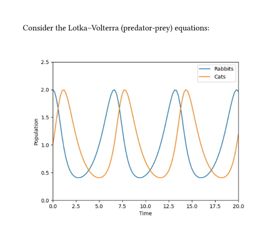

<h1 align="center">typst_pyimage</h1>

<p align="center">Wraps <a href="https://github.com/typst/typst">Typst</a> to support inline Python code for generating figures.</p>

## Example



```typst
#import ".typst_pyimage/pyimage.typ": pyimage

Consider the Lotka--Volterra (predator-prey)
equations:

#pyimage("
import diffrax
import jax.numpy as jnp
import matplotlib.pyplot as plt

def func(t, y, args):
  rabbits, cats = y
  d_rabbits = rabbits - rabbits*cats
  d_cats = -cats + rabbits*cats
  return d_rabbits, d_cats

term = diffrax.ODETerm(func)
solver = diffrax.Tsit5()
y0 = (2, 1)
t0 = 0
t1 = 20
dt0 = 0.01
ts = jnp.linspace(t0, t1, 100)
saveat = diffrax.SaveAt(ts=ts)
sol = diffrax.diffeqsolve(term, solver, t0,
                          t1, dt0, y0,
                          saveat=saveat)

plt.plot(ts, sol.ys[0], label='Rabbits')
plt.plot(ts, sol.ys[1], label='Cats')
plt.xlim(0, 20)
plt.ylim(0, 2.5)
plt.xlabel('Time')
plt.ylabel('Population')
plt.legend()
", width: 70%)
```

_(This example uses [JAX](https://github.com/google/jax) and [Diffrax](https://github.com/patrick-kidger/diffrax) to solve an ODE.)_

## Installation

```
pip install typst_pyimage
```

This requires that you're using Typst locally -- it won't work with the web app.

## Usage

1. Import `pyimage.typ`. At the start of your `.typ` file, add the line `#import ".typst_pyimage/pyimage.typ": pyimage`.

2. Use the `pyimage` function. This has syntax `pyimage(string, ..arguments) -> content`. The positional string should be a Python program that creates a single matplotlib figure. Any named arguments are forward on to Typst's built-in `image` function. You can use it just like the normal `image` function, e.g. `#align(center, pyimage("..."))`.

3. Compile or watch. Run either of the following two commands:
    ```
    python -m typst_pyimage compile your_file.typ
    python -m typst_pyimage watch your_file.typ
    ```
    This will extract and run all your Python code. In addition it will call either `typst compile your_file.typ` or `typst watch your_file.typ`.

    The resulting images are saved in the `.typst_pyimage` folder.

## Limitations

1. The watcher just extracts all the `pyimage("...")` blocks via regex, and runs them in the order that they appear in the file. This means that (a) the `"` character may not appear anywhere in the Python code (even if escaped), and (b) trying to call `pyimage` dynamically (i.e. not with a literal string at the top level of your program) will not work.
2. Only `pyimage("...")` calls inside the single watched file are tracked.

We could probably lift 1a and 2 with a bit of effort. PRs welcome.
